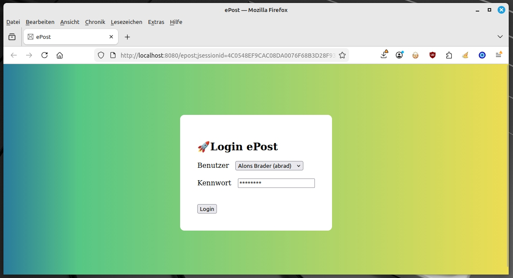
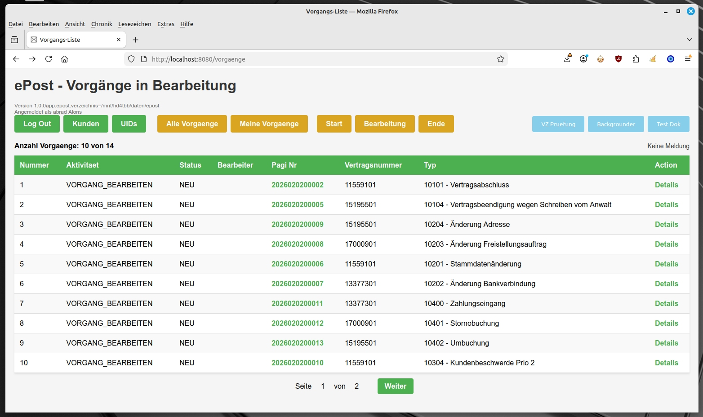
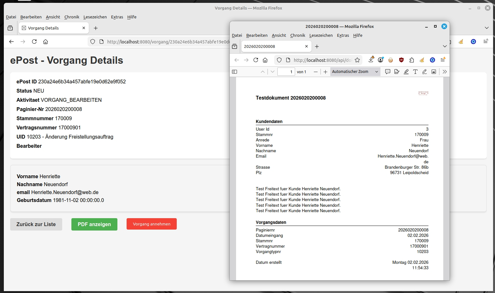

# ePost Vorgangsbearbeitung

Eine **Java Spring-Boot Anwendung**, um Vorgänge bearbeiten zu können.
  
  
**Referenzprojekt Java-Spring Schulung.**  
**Beispielprojekt um eine alte Lotus-Notes-Anwendung nachzubauen.**



## Zielbestimmung
Es soll ein System für die Bearbeitung von Vorgängen erstellt werden.  
Die Vorgänge werden dabei aus simulierten Posteingängen über eine Verzeichnisüberwachungg
erstellt.


Es soll eine "modernisierte" Version einer Vorgangsverarbeitung erstellt werden.  
Das Altsystem für diese Anwendung, war eine Lotus-Notes-Anwendung.


  
Diese Anwendung soll die Architektur des Altsystems nachstellen.  
Das bedeutet folgendes
- Die Tabelle für die Dokumentspeicherung steht für sich alleine.<br/>
Die Tabelle hat keine Referenzen auf die Vorgangstabelle.<br/>
Im Altsystem war das Archivsystem ein eigener Server.
- Die Unterlagenhistorie steht ebenfalls für sich alleine.<br/>
Im Altsystem war dieses ebenfalls ein eigener Server.

## Ablauf


```
Posteingang (PDF, XML, RDY) → Verzeichnisüberwachung → Backgrounder
```


### Posteingang 
Ein Posteingang besteht aus 3 Dokumenten  
Die Dokumente haben den gleichen Dateinamen.

2026020200004.pdf
2026020200004.xml
2026020200004.rdy

Der Dateiname besteht aus der jeweilen Paginiernummer des Posteinganges.

| Datei | Beschreibung |
| ----------- | ----------- |
| PDF | Der eingescante Posteingang vom Kunden als PDF-Datei  |
| XML | Die zusätzlichen Daten für den Posteingang. OCR-Daten, Kundennummer, ermittelter Dokumententyp (UID) | 
| RDY | Startdatei für die Verzeichnisüberwachung. Zeigt an, dass die Daten verarbeitet werden dürfen |

Diese Dateien werden in einem Eingangsverzeichnis zur Verfügung gestellt.

Dieses Verzeichnis wird in den Application Properties definiert. 


### Verzeichnisüberwachung

Die Verzeichnisüberwachung hat die Aufgabe die Dateien des Eingabeverzeichnisses zu verarbeiten.  
Das PDF-Dokument wird in das Archiv eingestellt.  
Die XML-Datei wird geparst und zu Vorgängen gemacht.  

#### Dateiprüfung
Die Verarbeitung startet mit den RDY-Dateien.  
Es wird der Dateiname auf eine korrekte Paginiernummer geprüft.  
Eine korrekte Paginiernummer besteht nur aus Zahlen und in den ersten 8 Ziffern muss ein Datum stehen.  
Handelt es sich nicht um eine korrekte Paginiernummer, werden die anderen Dateien nicht verarbeitet.
  
Zu jeder RDY-Datei wird geprüft, ob es eine XML und eine PDF-Datei gibt.  
Ist das nicht der Fall, kann keine Verarbeitung durchgeführt werden.

Die XML-Datei muss geparst werden können.  
Die PDF-Datei muss eine gültige PDF-Signatur aufweisen.  
  
Diese Prüfungen sollen verhindern, dass falsche Daten verarbeitet werden.  

#### Archivierung
Die PDF-Datei wird in der Archiv-Tabelle als BLOB gespeichert.  

Um das Dokument wieder auffinden zu können, wird die Paginiernummer gespeichert.  

Für spätere Erweiterungen, wird der Dateityp gespeichert. Aktuell ist hier nur PDF vorgesehen.

#### Vorgangserstellung
Mit den Daten aus der XML-Datei werden Vorgänge in der Vorgangstabelle erstellt.  
  
Aus einem Posteingang können mehrere Vorgänge hervorgehen (z.B. Freistellungsauftrag und Sepa-Mandat kommen 
in einem Brief).  

Die Vorgänge werden in der Vorgangstabelle mit der Aktivität "Start" und dem Status "Neu" eingestellt.

#### Dateiverschiebung nach Verarbeitung
Verarbeitete Eingangsdateien, werden aus dem Eingangsverzeichnis in ein Sicherungsverzeichnis verschoben.  

Das Rootverzeichnis für diese Sicherungsverzeichnisse werden in den Application-Properties definiert.  

Für jeden Tag wird dort ein Unterverzeichnis angelegt, in welchem die Verarbeitungsdateien verschoben werden.  

Es ist hier das Ziel, das Eingangsverzeichnis zu leeren.  


### Background Agent
Der Background-Agent hat die Aufgabe die Vorgänge durch den Workflow zu routen.  

Der Background-Agent wird periodisch ausgeführt, kann aber auch manuell gestartet werden.  

Die Ausführung hat 2 Aufgaben
- Weiterleitung von Vorgängen im Status "READY_TO_ROUTE"
- Aufruf der Aktivitäten

Die Aktivitäten sind in dieser Anwendung vordefiniert:  

| Aktivität | Beschreibung |
| ----------- | ----------- |
| Start | Neue Vorgänge aus der Verzeichnisüberwachung |
| Workflow | Start von definierten Workflows für einen Vorgang.<br/><br/> Dieses kann durch Aufruf von Stored-Procedures oder durch den Aufruf von http-Schnittstellen erfolgen<br/><br/>In dieser Anwendung werden keine Aktionen ausgeführt. | 
| Vorgang bearbeiten | Aktivität in welcher die Vorgänge durch den Anwender angenommen und abgeschlossen werden müssen. |
| Statistik Abschluss | Schreibt die Unterlagenhistorie für den Kunden |
| Ende | Aktivität für beendete Vorgänge |
 
#### Vorgangsweiterleitung
Für jede Aktivität werden Vorgänge in die jeweils nächste Aktivität verschoben.   
Damit ein Vorgang verschoben werden darf, muss dieser den Status "READY_TO_ROUTE" haben.
  
Weitergeleitete Vorgänge bekommen den Vorgangsstatus "NEU".  
Ist die neue Aktivität "Ende", wird der Vogangsstatus auf "ABGESCHLOSSEN" gesetzt.

#### Aktivitätsausführung
Für jede Aktivität gibt es eine Verarbeitungsklasse.  
In dieser Verarbeitungsklasse werden jeweils Aktionen für den aktuellen Vorgang ausgeführt.  
  
Damit ein Vorgang von einer Aktivität verarbeitet werden kann, muss der Vorgang den Status "NEU" haben.
  
# Oberfläche


## Vorgänge in Aktivität "Vorgang bearbeiten"



Nach dem Log-In erscheint die Übersicht alle Vorgänge in der Aktivität "Vorgang bearbeiten".  
  

  
Für die Navigation, gibt es verschieden farbige Buttons.

| Farbe | Beschreibung |
| ----------- | ----------- |
| Grün | Anwendungsnavigation <br>-Logout<br>-Kundenanzeige<br>-Vorgangstypen |
| Gelb | Vorgangsfilterung<br>Es werden die angezeigten Vorgänge nach Kriterien gefiltert| 
| Blau | Startet Background-Aktivitäten <br>-VZ Prüfung - Startet die Verzeichnisüberwachung<br>-Backgrounder - Startet den Background-Agenten<br>-Test-Dok - Erstellt Testeingänge im Eingabeverzeichnis für jeden Kunden |
   
  
  
Es werden die Vorgänge im aktuell gewählten Filter angezeigt.  
Mit einem Click auf die Paginiernummer, kann das PDF-Dokument angezeigt werden.  
Der Link "Details" verzweigt auf die Detail-Seite des Vorganges.  
  

## Vorgangsdetail-Anzeige

  


In der Vorgangsdetailanzeige kann der Vorgang von dem Anwender angenommen und abgeschossen werden.
Hierzu werden entsprechnede Schaltflächen eingeblendet.
  
- Ein einmal angenommener Vorgang kann nicht nochmal angenommen werden. 
- Ein einmal abgeschlossener Vorgang kann nicht nochmal angenommen werden. 
- Ein Vorgang kann nur von dem ursprünglichen Bearbeiter abgeschlossen werden.


Mit dem Button "PDF anzeigen" kann das PDF-Dokument angezeigt werden.

Mit dem Button "Zurück zur Liste" wird wieder in die Vorgangsanzeige verzweigt.


# Getting started

## application.properties
  

Es müssen hier Verzeichnispfade eingetragen werden, auf welche der aktuelle Benutzer schreibrechte hat.  

Die Pfade werden durch das Programm jedes mal neu angelegt.  

 
```
app.epost.verzeichnis=/mnt/hd4tbb/daten/epost
app.epost.verzeichnis_input=/mnt/hd4tbb/daten/epost/input
app.epost.verzeichnis_root=/mnt/hd4tbb/daten/epost/root_verarbeitung
```
  
  


## application-mysql.properties

In dieser Datei muss die Einstellung für die Datenbank auf "create-drop" geändert werden.  

  

```
#spring.jpa.hibernate.ddl-auto=create-drop
spring.jpa.hibernate.ddl-auto=update
```


## Erster start

Wird die Anwendung gestartet, werden in der Datenbank die Tabellen angelegt und mit den hinterlegten Testdaten bestückt.  
  
Dieses Verhalten wird durch die Klasse de.ea234.epost.model.AppTestInit ausgelöst.  
  


 

