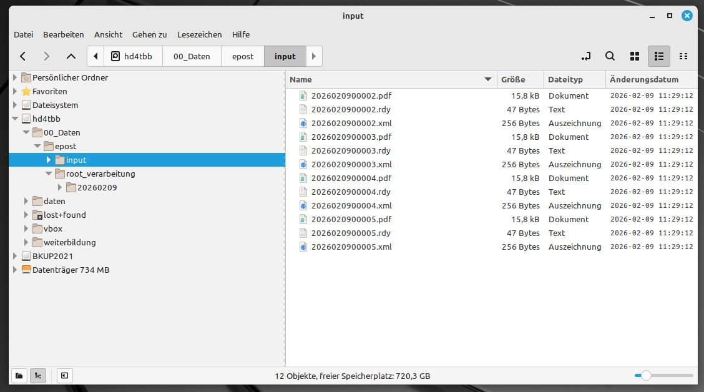
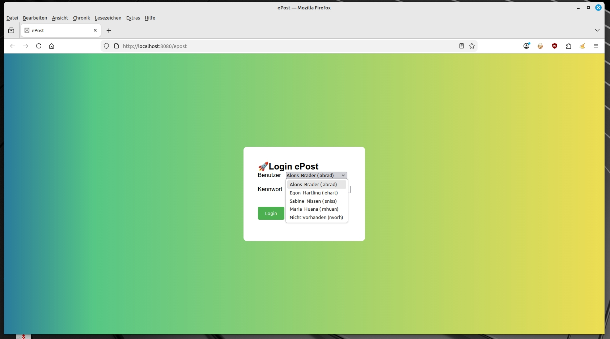
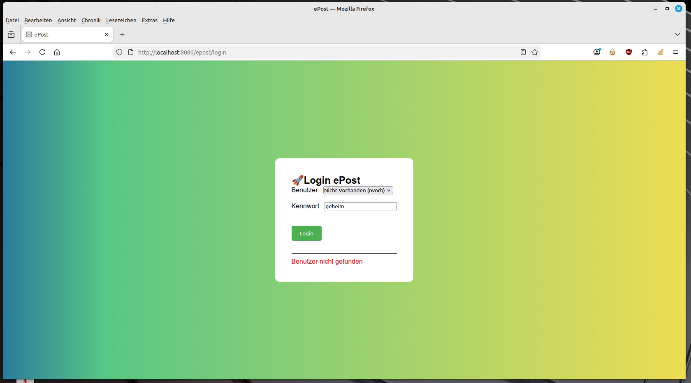
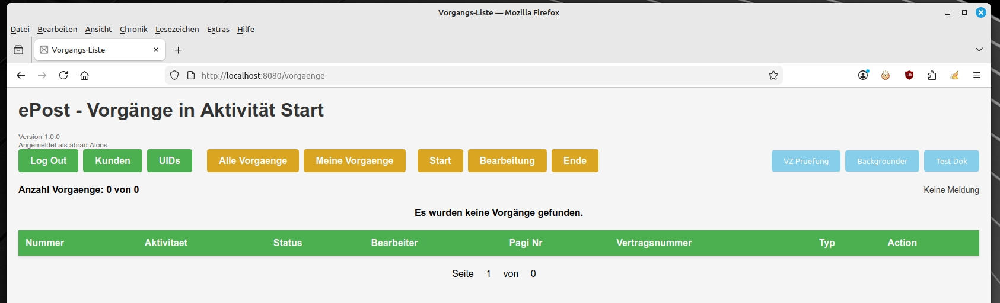
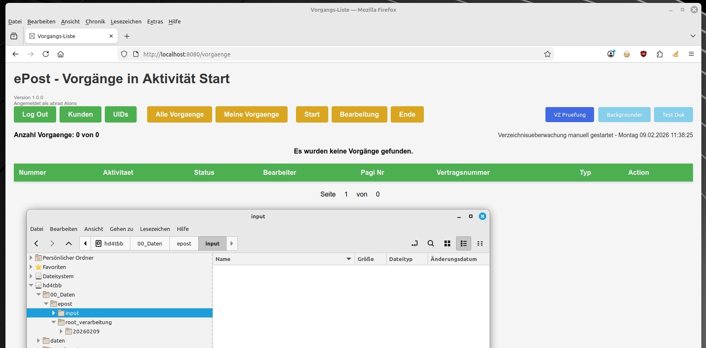
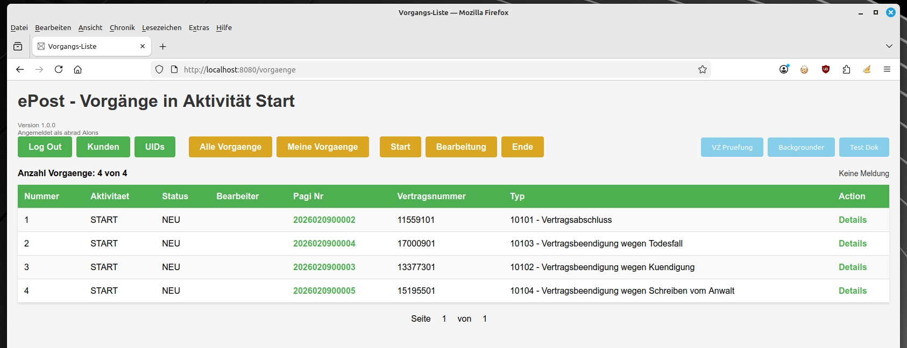
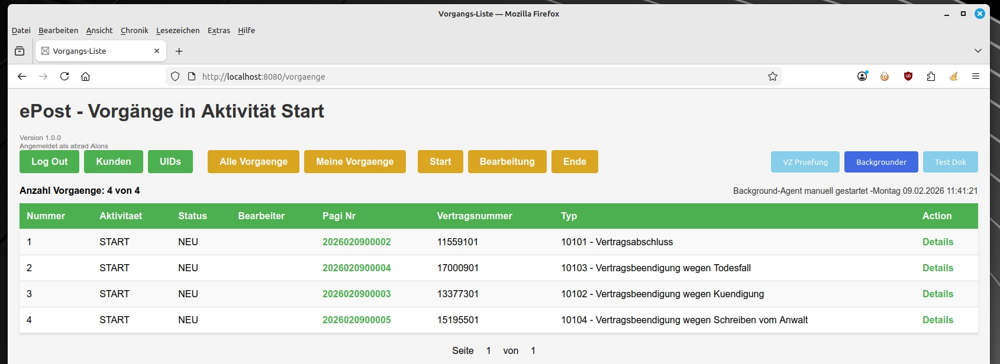
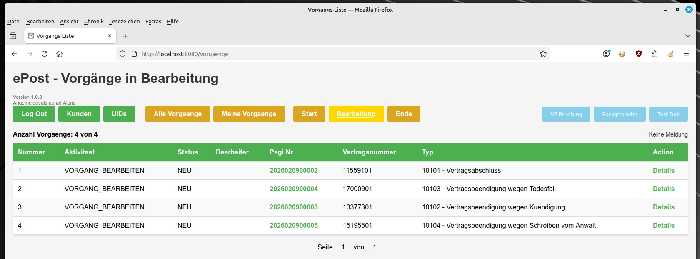
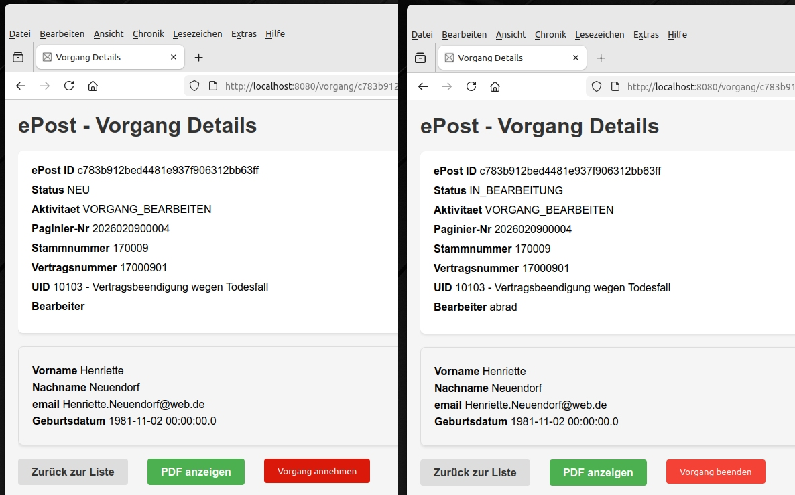

# ePost  
## Ablauf der Anwendung

**Autor:** Eckbert Andresen  
**Datum:** 23.12.2025  
**Version:** 1.0  

Es folgt eine Beschreibung der Verarbeitung von Posteingängen und Vorgängen im System "ePost"

Dabei ist hier die Testdatenerstellung der Anwendung aktiv.


### Anwendungsstart

Wird die Anwendung gestartet, werden die Tabellen in der Datenbank und die benötigten Verzeichnisse angelegt. 
Die Verzeichnisse werden in der application.properties-Datei konfiguriert:

```
app.epost.verzeichnis=/mnt/hd4tbb/00_Daten/daten/epost
app.epost.verzeichnis_input=/mnt/hd4tbb/00_Daten/epost/input
app.epost.verzeichnis_root=/mnt/hd4tbb/00_Daten/epost/root_verarbeitung
```
<br/>  

Es werden 4 Benutzer und 4 Kunden mit jeweils einem Vertrag angelegt. 
  
Für jeden Kunden wird zusätzlich ein Test-Posteingang im Eingangsverzeichnis erstellt.
Dieser Testeingang besteht aus den 3 Dateien:  

| Datei | Beschreibung |
| ----------- | ----------- |
| PDF | Der eingescante Posteingang vom Kunden als PDF-Datei  |
| XML | Meta-Daten für den Posteingang. OCR-Daten, Kundennummer, ermittelter Dokumententyp (UID) | 
| RDY | Startdatei für die Verzeichnisüberwachung. Zeigt an, dass die Daten verarbeitet werden dürfen |


Der Dateiname ist bei jeder Datei die jeweilige Paginiernummer.

<br/>


  

Testdateien im Eingangsverzeichnis

<br/>

---

## 1. Log In
Nach dem Start ist die Anwendung ist unter folgendem Link zu finden:  
http://localhost:8080/epost



Alle verfügbaren Anwender stehen in einer Combo-Box zur Auswahl.

Das Kennwort ist in dieser Demonstrationsanwendung für alle Benutzer "geheim".

<br/>


<br/>


<br/>




<br/>


---

## 2. Ablaufsteuerung

Nach dem Login kommt der Benutzer in die Anzeige aller Vorgänge in der Aktivität "Vorgang bearbeiten".  
  
In dieser Beschreibung wurde nach dem Log-In jedoch auf die Schaltfläche "Start" geclickt.
Daraufhin werden alle Vorgänge in der Aktivität "Start" angezeigt.  
  

Es erscheint ein Hinweis, dass keine Vorgänge gefunden worden sind.  



<br/>

Damit Vorgänge in die ePost eingestellt werden, muss die Verzeichnisüberwachung laufen. 
  
Die Verzeichnisüberwachung läuft automatisch alle halbe Stunde. 
Die Verzeichnisüberwachung kann aber auch aus der Oberfläche heraus gestartet werden. 
Dazu dient die Schaltfläche "VZ Prüfung".
Nach dem Start, wird eine entsprechende Meldung in der Oberlfäche angezeigt.   
Die Dateien im Eingangsverzeichnis sind verschwunden und wurden in das Sicherungsverzeichnis des Tages verschoben.  

  
Damit die jetzt erstellten Vorgänge angezeigt werden, muss die Anzeige mit einem Click auf "Start" aktualisiert werden.


<br/>

<br/>
Nach der Aktualiesierung der Anzeige sind die neu erstellten Vorgänge sichtbar.  
  
Diese Vorgänge stehen jetzt aber in der ersten Workflow-Aktivität "Start".  
  
In dieser Aktivität können die Vorgänge nicht von einem Bearbeiter angenommen werden.  

Die Vorgänge müssen jetzt durch den Workflow geroutet zur Aktivität "Vorgang Bearbeiten" geroutet werden.  
  
Dieses Routing wird vom Background-Agenten gemacht. Dieser Background-Agent läuft automatisch alle 30 Minuten.  
  
Der Background-Agent kann von der Oberfläche heraus auch manuell gestartet werden.  
Hierzu ist die Schaltfläche "Backgrounder" vorgesehen. 
Nach dem Start wird ebenfalls wieder eine Meldung in der Statuszeile ausgegeben.  

<br/>
Nach dem Background-Agent gelaufen ist, sind die Vorgänge aus der Aktivität "Start" verschwunden und 
stehen jetzt in der Aktivität "Vorgang bearbeiten" bereit.  
Ein Click auf die Schaltfläche "Bearbeitung" wechselt zur Anzeige der Vorgänge in der 
Aktivtät "Vorgang Bearbeiten".  



Die Vorgänge stehen hier für die "Annahme" von den Sachbearbeitern zur Verfügung.  
  
Damit ein Vorgang von einem Sachbearbeiter angenommen werden kann, muss zuerst in die Detail-Ansicht des Vorganges gegangen werden.
Dazu ist in der Liste der Link "Details" vorhanden.


<br/>
Die Vorgangsdetails beinhalten die technischen Daten zum Vorgang, die Kundendaten und einen Button 
für die Anzeige des gespeicherten Poststückes.  


<br/>
  
Der Sachbearbeiter kann den Vorgang mit dem Button "Vorgang annehmen" für die Bearbeitung annehmen. 
  
Nach dem Annehmen eines Vorganges verschwindet der Button "Vorgang annehmen", dafür wird der 
Butotn "Vorgang beenden" eingeblendet. Desweiteren ist der aktuelle Benutzer jetzt als Bearbeiter im Vorgang eingetragen worden.
  
Ein Vorgang kann nur vom selben Bearbeiter beendet werden, welcher den Vorgang angenommen hat.  
Ein angenommener Vorgang kann nicht nochmal angenommen werden.  
  
Wurde ein Vorgang von einem anderem als dem aktuellen Benutzer angenommen, ist kein Button "Vorgang beenden" zu sehen.


<br/>
In der Ansicht der Vorgänge ist nun ersichtlich, welche Vorgänge angenommen sind.

Die beendeten Vorgänge müssen jetzt weiter durch den Workflow geroutet werden.  
Hierzu ist wieder der Button "Backgrounder" zu benutzen. 

Beendete Vorgänge schreiben einen Datensatz in die Unterlagenhistorie des Kunden. 
Dieses Schreiben der Unterlagenhistorie wird in der Aktivität "Statistik Abschluss" gemacht.  
Das ist eine automatische Aktivität, welche im Hintergrund ausgeführt wird. 
  
Schlussendlich werden die Vorgänge in die Aktivität "Ende" weitergeleitet. 


<br/>---


